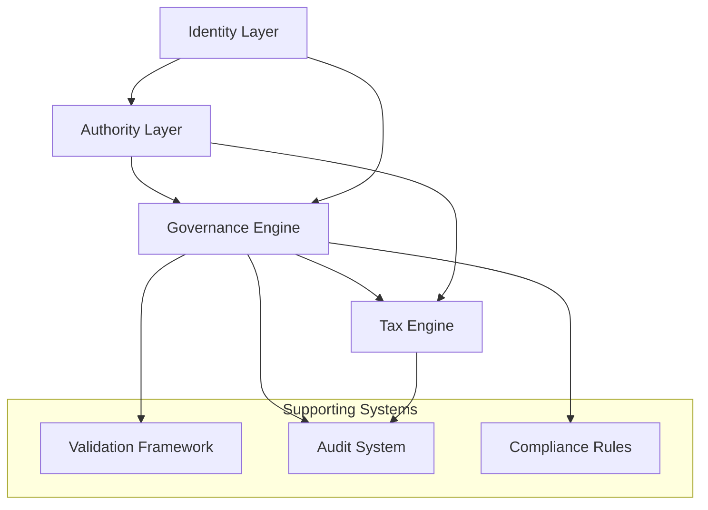

Conflict Rules

Certain permissions cannot be granted together due to segregation of duties:

1. perm_issue_credit + perm_audit_access = ❌ Conflict
   · Credit issuers cannot audit their own transactions
2. perm_system_config + perm_delegate_auth = ❌ Conflict
   · System administrators cannot delegate financial authority
3. perm_tax_override + perm_compliance_override = ⚠️ Warning
   · Requires additional approval layers
4. perm_revoke_credit + perm_adjust_limits = ❌ Conflict
   · Different teams should handle these functions

Escalation Paths

Amount-Based Escalation

Amount Required Approvals
Up to $10,000 Automated
$10,001 - $50,000 Supervisor
$50,001 - $100,000 Manager
$100,001 - $500,000 Director
Over $500,000 C-Level + Legal

Risk-Based Escalation

Risk Level Escalation Threshold
Low None
Medium Department Head
High Compliance + Legal
Critical Board Committee

Audit Requirements

Logging Levels

· Info: All permission usage logged
· Warning: Medium+ risk permissions
· Error: High+ risk permissions with failures
· Critical: All critical risk permissions

Retention Periods

· Low Risk: 1 year
· Medium Risk: 3 years
· High Risk: 7 years
· Critical Risk: Permanent

Immutable Logging

Required for:

· All critical risk permissions
· Tax-related permissions
· Compliance overrides
· System configuration changes

Tax Implications

Tax Event Generation

Permissions that generate tax reporting requirements:

· perm_issue_credit → 1099-INT if interest paid
· perm_initiate_transfer → Potential 1099-B
· perm_tax_override → Requires additional documentation

Form Requirements

Permission Forms Required
perm_issue_credit W-9, 1099-INT
perm_withholding_management W-4, W-9, 941
perm_tax_reporting Various 1099 series

Implementation Notes

1. Permission Inheritance

· Prerequisites are automatically granted when requesting dependent permissions
· Inheritance chain is validated during authority creation

2. Temporal Restrictions

· High-risk permissions may have time-of-day restrictions
· Critical permissions may require re-authorization after 24 hours

3. Geographic Limitations

· Some permissions are jurisdiction-specific
· Tax-related permissions vary by country/state

4. Delegation Constraints

· Delegated permissions cannot exceed delegator's permissions
· Maximum delegation depth: 3 levels
· Delegations expire after 30 days by default

---

Revision History

Version Date Changes Author
1.0.0 2024-01-15 Initial release System Team
0.9.0 2024-01-10 Draft for review Compliance Team

---

Document Status: Approved
Next Review: 2024-07-15
Owner: Security & Compliance Department
Contact: compliance@richards-credit-authority.example.com

```

## 7. Documentation

### `docs/overview.md`

```markdown
# Richard's Credit Authority - System Overview

## Introduction

Richard's Credit Authority is a comprehensive identity, authority, and compliance management system designed to facilitate secure credit operations while maintaining strict governance and tax compliance.

## System Architecture

### Core Components



1. Identity Layer

· Purpose: Digital identity verification and management
· Components:
  · Identity schemas and validation
  · Verification workflows
  · Identity lifecycle management
· Key Features:
  · Multi-factor verification
  · Risk-based identity scoring
  · Cross-system identity reconciliation

2. Authority Layer

· Purpose: Permission and access control management
· Components:
  · Authority schemas and validation
  · Permission matrices
  · Delegation chains
· Key Features:
  · Granular permission control
  · Delegation with constraints
  · Temporal and geographic restrictions

3. Governance Engine

· Purpose: Apply business rules and policies
· Components:
  · Rule-based validation
  · Approval workflows
  · Risk assessment
· Key Features:
  · Configurable business rules
  · Real-time policy enforcement
  · Audit trail generation

4. Tax Engine

· Purpose: Tax calculation and compliance
· Components:
  · Jurisdiction-aware tax rules
  · Withholding calculations
  · Reporting requirements
· Key Features:
  · Multi-jurisdiction support
  · Real-time tax calculations
  · Form generation

Key Concepts

Digital Identity

A verified digital representation of an entity (individual, business, etc.) that includes:

· Legal identification
· Verification status
· Contact information
· Risk assessment

Authority Grant

A time-bound, scoped permission set granted to a verified identity, including:

· Specific permissions
· Geographic scope
· Monetary limits
· Temporal constraints

Governance Rule

A business rule that evaluates authority requests against:

· Identity verification levels
· Risk thresholds
· Compliance requirements
· Tax obligations

Tax Jurisdiction

A geographic area with specific tax rules, including:

· Tax rates and brackets
· Reporting requirements
· Withholding rules
· Compliance deadlines

Data Flow

1. Identity Onboarding

```
User Submission → Identity Validation → Verification Workflow → Identity Storage
```

2. Authority Request

```
Identity Request → Permission Selection → Governance Evaluation → Authority Grant
```

3. Transaction Processing

```
Transaction Initiation → Tax Calculation → Compliance Check → Execution → Audit Logging
```

4. Reporting

```
Data Collection → Report Generation → Compliance Review → Submission
```

Security Model

Authentication

· Multi-factor authentication
· API key management
· Session management

Authorization

· Role-based access control
· Permission-based restrictions
· Delegation controls

Audit & Compliance

· Immutable audit logs
· Real-time monitoring
· Compliance reporting

Integration Points

External Systems

· Identity Providers: Government databases, credit bureaus
· Financial Systems: Banking APIs, payment processors
· Compliance Systems: Regulatory reporting platforms
· Tax Systems: Tax calculation services

APIs

· REST API: For system integration
· Webhooks: For event notifications
· Batch Processing: For bulk operations

Deployment Architecture

Development Environment

· Local development with Docker
· CI/CD pipeline
· Automated testing

Staging Environment

· Full system integration
· Performance testing
· User acceptance testing

Production Environment

· High availability setup
· Disaster recovery
· Continuous monitoring

Technology Stack

Backend

· Language: Python 3.11+
· Framework: Custom with FastAPI elements
· Database: PostgreSQL with JSON support
· Cache: Redis for session management

Frontend (Future)

· Framework: React with TypeScript
· State Management: Redux Toolkit
· UI Library: Material-UI

Infrastructure

· Containerization: Docker
· Orchestration: Kubernetes
· Monitoring: Prometheus + Grafana
· Logging: ELK Stack

Compliance Framework

Regulatory Requirements

· Identity: KYC/AML regulations
· Financial: Banking regulations
· Tax: IRS and state tax laws
· Privacy: GDPR, CCPA compliance

Certifications (Planned)

· SOC 2 Type II
· ISO 27001
· PCI DSS (if processing payments)

Performance Characteristics

Scalability

· Horizontal scaling for all components
· Database sharding support
· Cached tax calculations

Reliability

· 99.9% uptime target
· Automated failover
· Regular backups

Performance

· Sub-second response for 95% of requests
· Batch processing for large operations
· Optimized database queries

Development Guidelines

Code Quality

· Type hints throughout
· Comprehensive test coverage
· Code review requirements
· Automated linting

Documentation

· API documentation with OpenAPI
· Architecture decision records
· Operational runbooks
· User guides

Security

· Regular security audits
· Dependency vulnerability scanning
· Secret management
· Encryption at rest and in transit

Roadmap

Phase 1 (Current)

· Core identity and authority schemas
· Basic validation framework
· Governance engine foundation
· Federal tax rules

Phase 2 (Q2 2024)

· State tax rules (all 50 states)
· Advanced identity verification
· API development
· Basic frontend interface

Phase 3 (Q3 2024)

· International tax rules
· Machine learning for risk assessment
· Mobile application
· Integration marketplace

Phase 4 (Q4 2024)

· Real-time compliance monitoring
· Advanced reporting suite
· Partner integrations
· Enterprise features

Getting Started

Prerequisites

· Python 3.11 or higher
· PostgreSQL 14 or higher
· Redis 7 or higher

Installation

```bash
# Clone the repository
git clone https://github.com/RickCreator87/richards-credit-authority.git

# Install dependencies
pip install -r requirements.txt

# Set up environment variables
cp .env.example .env

# Initialize database
python scripts/init_db.py

# Run the system
python cli.py
```

Quick Start

1. Create an example identity:

```bash
python cli.py process --type individual templates/identity-example.yaml
```

1. Validate an authority request:

```bash
python cli.py validate templates/authority-example.yaml
```

1. Run the test suite:

```bash
pytest tests/
```

Support

Documentation

· Usage Guide
· Schema Reference
· API Documentation

Community

· GitHub Issues for bug reports
· Discussions for questions
· Pull requests for contributions

Professional Support

Available for enterprise customers:

· implementation@richards-credit-authority.example.com

License

Copyright © 2024 Richard's Credit Authority. All rights reserved.

Proprietary software. See LICENSE file for details.

```

