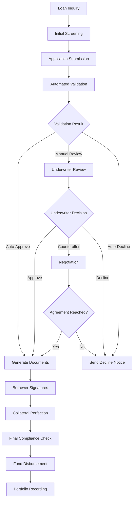
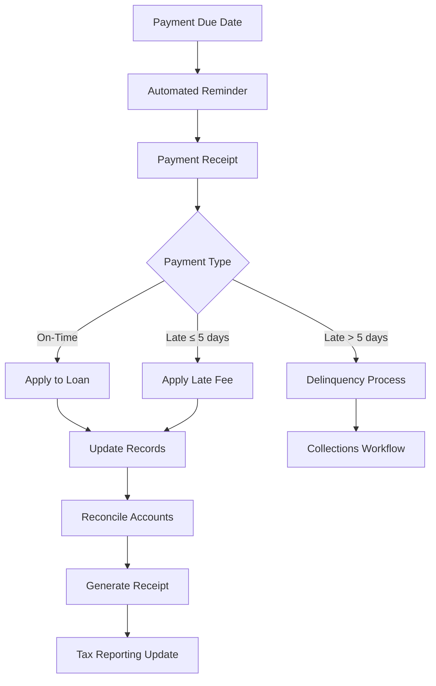

📁 PHASE 1: FINANCIAL PARAMETERS (Critical - 10 files)

RISK-PROFILE.yaml

```yaml
# ============================================
# RISK PROFILE - Richard's Credit Authority
# ============================================

metadata:
  version: "1.0.0"
  profileId: "RISK-PROFILE-001"
  riskAppetite: "Conservative Growth"
  lastAssessed: "2024-11-01"

# ============ RISK TOLERANCE ============
riskTolerance:
  capitalPreservation: "High Priority"
  growthExpectation: "6-8% annual return"
  volatilityAcceptance: "Low"
  maximumDrawdownAcceptable: "15%"
  recoveryPeriod: "12 months maximum"

  psychologicalFactors:
    stressTriggers:
      - "Consecutive late payments > 3"
      - "Single exposure > $500,000"
      - "Sector concentration > 40%"
    comfortZones:
      - "Real estate collateral"
      - "Texas-based borrowers"
      - "Technology sector"

# ============ PORTFOLIO CONSTRUCTION ============
portfolioConstruction:
  targetAllocation:
    securedLoans: "70%"
    unsecuredLoans: "20%"
    bridgeFinancing: "10%"
  
  sectorLimits:
    realEstate: "40%"
    technology: "30%"
    healthcare: "15%"
    consumer: "10%"
    other: "5%"
  
  geographicConcentration:
    texas: "60%"
    otherUS: "30%"
    international: "10%"
  
  borrowerConcentration:
    maximumSingleBorrower: "20%"
    top5BorrowersMaximum: "50%"
    minimumNumberBorrowers: "10"

# ============ CREDIT RISK PARAMETERS ============
creditRisk:
  creditScoreRequirements:
    tier1: "750+ (Preferred)"
    tier2: "700-749 (Standard)"
    tier3: "650-699 (Higher Rate)"
    minimum: "620"
  
  debtToIncomeRatios:
    maximumDTI: "45%"
    preferredDTI: "35%"
    exceptionsAllowed: "Up to 50% with strong collateral"
  
  loanToValueRatios:
    realEstate: "80% maximum"
    securities: "70% maximum"
    equipment: "60% maximum"
    personalGuarantee: "100% (unsecured)"
  
  defaultProbabilities:
    acceptableAnnualDefaultRate: "2%"
    maximumTolerableDefaultRate: "5%"
    expectedLossGivenDefault: "40%"

# ============ OPERATIONAL RISK ============
operationalRisk:
  systemDependencies:
    critical:
      - "Document management system"
      - "Payment processing"
      - "Communication systems"
    backupPlans:
      - "Manual processes available"
      - "Paper documentation"
      - "Alternative payment methods"
  
  fraudPrevention:
    controls:
      - "Dual authorization for disbursements > $10,000"
      - "Independent verification of collateral"
      - "Background checks for large loans"
      - "Document authenticity verification"
    monitoring:
      - "Monthly transaction review"
      - "Quarterly fraud assessment"
      - "Annual control testing"

# ============ MARKET RISK ============
marketRisk:
  interestRateRisk:
    exposure: "Limited (floating rate loans < 30%)"
    hedgingStrategy: "Natural hedge through duration matching"
    stressScenario: "Rates increase 300 bps"
    impact: "Portfolio value decrease 8%"
  
  economicScenarioAnalysis:
    recessionScenario:
      probability: "20% over 5 years"
      impact: "Defaults increase to 6%"
      mitigation: "Reserve fund increased to 10%"
    expansionScenario:
      probability: "30% over 5 years"
      impact: "Defaults decrease to 1%"
      action: "Increase lending capacity"
  
  collateralRisk:
    valuationFrequency:
      realEstate: "Annual"
      securities: "Monthly"
      cryptocurrency: "Daily"
    haircuts:
      realEstate: "20%"
      publiclyTradedSecurities: "30%"
      privateSecurities: "50%"
      cryptocurrency: "60%"

# ============ LIQUIDITY RISK ============
liquidityRisk:
  cashRequirements:
    operatingExpenses: "3 months coverage"
    reserveFund: "5% of portfolio"
    emergencyFund: "$100,000 minimum"
  
  fundingSources:
    primary: "Personal capital"
    secondary: "Investment portfolio (30-day liquidity)"
    tertiary: "Credit lines (unused capacity)"
  
  stressTesting:
    scenario1: "20% of loans default simultaneously"
    scenario2: "Market crash - collateral values drop 40%"
    scenario3: "Personal liquidity event"
    responsePlan: "Activate reserves, halt new lending, restructure portfolio"

# ============ COMPLIANCE RISK ============
complianceRisk:
  regulatoryChanges:
    monitoring: "Monthly regulatory update review"
    assessment: "Quarterly impact analysis"
    implementation: "90-day compliance window"
  
  reportingRequirements:
    federal:
      - "Form 1099-INT (annual)"
      - "Suspicious Activity Reports (as needed)"
      - "Currency Transaction Reports (if applicable)"
    state:
      - "Texas Finance Code reporting (if threshold met)"
      - "State tax withholding (if applicable)"
  
  auditExposure:
    internalAudit: "Quarterly"
    externalAudit: "Annual"
    regulatoryAudit: "Always prepared"

# ============ STRESS TESTING SCENARIOS ============
stressTests:
  severeScenario:
    name: "2008-style Financial Crisis"
    assumptions:
      - "GDP contraction: 5%"
      - "Unemployment: 12%"
      - "Real estate decline: 30%"
      - "Stock market decline: 40%"
    portfolioImpact:
      - "Defaults: 15%"
      - "Collateral value reduction: 35%"
      - "Recovery period: 3 years"
    actions:
      - "Activate full reserve fund"
      - "Suspend new lending"
      - "Focus on collections"
      - "Restructure performing loans"
  
  moderateScenario:
    name: "Interest Rate Spike"
    assumptions:
      - "Fed funds rate: 6%"
      - "10-year Treasury: 5.5%"
      - "Inflation: 5%"
    portfolioImpact:
      - "Default increase: 4%"
      - "Refinancing demand: High"
      - "Portfolio value: -10%"
    actions:
      - "Increase interest rate floors"
      - "Review floating rate exposures"
      - "Offer refinancing to strong borrowers"

# ============ RISK MITIGATION STRATEGIES ============
mitigation:
  diversification:
    - "Minimum 10 borrowers"
    - "Maximum 3 loans per sector initially"
    - "Geographic spread"
  
  collateralization:
    - "Collateral required > $100,000"
    - "Regular collateral revaluation"
    - "Insurance requirements for physical collateral"
  
  covenants:
    financialCovenants:
      - "Debt service coverage ratio > 1.25"
      - "Current ratio > 1.0"
      - "Maximum additional debt"
    reportingCovenants:
      - "Annual financial statements"
      - "Quarterly updates if requested"
      - "Immediate notification of material changes"
  
  reservePolicy:
    generalReserve: "5% of portfolio"
    specificReserve: "For loans > 90 days past due"
    funding: "From interest income"

# ============ RISK COMMITTEE ============
riskCommittee:
  members:
    - "Richard D. Kindler(Chair)"
    - "[Risk Advisor]"
    - "[Legal Counsel] (Advisory)"
  responsibilities:
    - "Review risk profile quarterly"
    - "Approve exceptions to risk limits"
    - "Monitor stress test results"
  meetingFrequency: "Quarterly"
  escalationPath: "Direct report to Credit Committee"

# ============ MONITORING & REPORTING ============
monitoring:
  keyRiskIndicators:
    - "Portfolio default rate (monthly)"
    - "Concentration limits (weekly)"
    - "Collateral coverage (monthly)"
    - "Liquidity position (daily)"
  
  reporting:
    dashboards: "Real-time risk dashboard"
    monthlyReport: "Risk metrics and trends"
    quarterlyReport: "Comprehensive risk assessment"
    annualReport: "Full risk profile review"
  
  triggers:
    yellowFlags:
      - "Single borrower > 15%"
      - "Sector concentration > 35%"
      - "Two consecutive late payments"
    redFlags:
      - "Single borrower > 20%"
      - "Sector concentration > 40%"
      - "Loan > 90 days past due"
      - "Collateral shortfall > 10%"

# ============ SIGNATURE ============
signature:
  approvedBy: "Richard D. Kindler"
  role: "Risk Manager & Credit Authority"
  date: "2026-11-01"
  reviewDate: "2026-02-01"
```

CREDIT-LIMITS.yaml

```yaml
# ============================================
# CREDIT LIMITS - Richard's Credit Authority
# ============================================

metadata:
  version: "1.0.0"
  effectiveDate: "2026-11-01"
  authority: "Richard D. Kindler"
  jurisdiction: "Texas, United States"

# ============ AGGREGATE LIMITS ============
aggregateLimits:
  totalLendingCapacity: "$5,000,000.00"
  currentlyDeployed: "$0.00"
  availableCapacity: "$5,000,000.00"
  
  tieredCapacity:
    tier1:  # Immediate deployment
      amount: "$500,000.00"
      source: "Liquid assets"
      deploymentTime: "Immediate"
    
    tier2:  # 30-day notice
      amount: "$1,500,000.00"
      source: "Investment portfolio"
      deploymentTime: "30 days"
    
    tier3:  # Extended capacity
      amount: "$3,000,000.00"
      source: "External financing"
      deploymentTime: "60-90 days"
      conditions: "Subject to syndication agreement"

# ============ BORROWER LIMITS ============
borrowerLimits:
  maximumSingleBorrowerExposure: "$1,000,000.00"
  
  tieredLimits:
    tierA:  # Preferred borrowers
      creditScore: "750+"
      maximumExposure: "$1,000,000.00"
      terms: "Most favorable"
    
    tierB:  # Standard borrowers
      creditScore: "700-749"
      maximumExposure: "$500,000.00"
      terms: "Standard"
    
    tierC:  # Higher risk
      creditScore: "650-699"
      maximumExposure: "$250,000.00"
      terms: "Higher rates, more collateral"
    
    tierD:  # Special cases
      creditScore: "620-649"
      maximumExposure: "$100,000.00"
      terms: "Case-by-case approval"
      additionalRequirements: "Strong collateral, personal guarantee"
  
  familyLimits:
    immediateFamily: "$250,000 maximum"
    extendedFamily: "$100,000 maximum"
    conditions: "Arm's length terms, documented"

# ============ PRODUCT LIMITS ============
productLimits:
  promissoryNotes:
    maximumAmount: "$1,000,000.00"
    minimumAmount: "$10,000.00"
    termRange: "6 months to 10 years"
    
  linesOfCredit:
    maximumCommitment: "$500,000.00"
    minimumCommitment: "$25,000.00"
    drawPeriod: "12 months maximum"
    repaymentPeriod: "24-60 months"
  
  bridgeLoans:
    maximumAmount: "$750,000.00"
    term: "3-12 months"
    purpose: "Real estate transactions only"
  
  equipmentFinancing:
    maximumAmount: "$300,000.00"
    term: "Up to 5 years"
    collateral: "Financed equipment"

# ============ COLLATERAL LIMITS ============
collateralLimits:
  realEstate:
    maximumLTV: "80%"
    acceptableTypes:
      - "Residential (primary, secondary)"
      - "Commercial (office, retail)"
      - "Land (developed only)"
    unacceptableTypes:
      - "Timeshares"
      - "Mobile homes not on owned land"
      - "Raw land without development plans"
  
  marketableSecurities:
    maximumLTV: "70%"
    acceptableTypes:
      - "Publicly traded stocks (NYSE, NASDAQ)"
      - "Government bonds"
      - "Investment-grade corporate bonds"
      - "ETFs"
    haircuts:
      - "Large cap stocks: 30%"
      - "Small cap stocks: 50%"
      - "Bonds: 20%"
      - "ETFs: 35%"
  
  cryptocurrency:
    maximumLTV: "60%"
    acceptableCoins:
      - "USDC"
      - "USDT"
      - "Bitcoin"
      - "Ethereum"
    haircuts: "40% minimum"
    custody: "Must be in regulated custodian"
  
  personalGuarantees:
    acceptableGuarantors:
      - "Business owners"
      - "High net worth individuals"
      - "Creditworthy family members"
    requirements:
      - "Personal financial statement"
      - "Credit check"
      - "Legal review"

# ============ GEOGRAPHIC LIMITS ============
geographicLimits:
  primaryJurisdiction: "Texas"
  texasAllocation: "Up to 60% of portfolio"
  
  unitedStates:
    acceptableStates:
      - "Texas"
      - "California"
      - "New York"
      - "Florida"
      - "Colorado"
      - "Washington"
    maximumOutOfState: "40% of portfolio"
  
  international:
    allowed: "No (except US territories)"
    exceptions: "Case-by-case with legal review"
  
  specialZones:
    disasterProneAreas:
      - "Florida coastal (hurricane)"
      - "California (earthquake, wildfire)"
      - "Midwest (tornado)"
    requirements: "Insurance coverage verification"

# ============ INDUSTRY/SECTOR LIMITS ============
sectorLimits:
  realEstate:
    maximumExposure: "40% of portfolio"
    subSectorLimits:
      - "Residential: 25%"
      - "Commercial: 15%"
      - "Land: 5%"
  
  technology:
    maximumExposure: "30% of portfolio"
    subSectorLimits:
      - "SaaS: 15%"
      - "Hardware: 10%"
      - "Services: 5%"
  
  healthcare:
    maximumExposure: "15% of portfolio"
    subSectorLimits:
      - "Medical services: 10%"
      - "Pharma/Devices: 5%"
  
  consumerGoods:
    maximumExposure: "10% of portfolio"
  
  other:
    maximumExposure: "5% per sector"
  
  prohibitedSectors:
    - "Gambling/casinos"
    - "Adult entertainment"
    - "Firearms manufacturing"
    - "Cryptocurrency mining"
    - "Speculative trading"

# ============ CONCENTRATION LIMITS ============
concentrationLimits:
  borrowerConcentration:
    maximumSingleBorrower: "20% of portfolio"
    top3BorrowersMaximum: "40% of portfolio"
    top5BorrowersMaximum: "60% of portfolio"
  
  collateralConcentration:
    maximumSingleCollateralType: "50% of portfolio"
    realEstateConcentration: "40% of portfolio"
    securitiesConcentration: "30% of portfolio"
  
  maturityConcentration:
    maximum12MonthMaturity: "30% of portfolio"
    maximum24MonthMaturity: "60% of portfolio"
    ladderingRequirement: "Spread maturities quarterly"

# ============ CREDIT QUALITY LIMITS ============
creditQualityLimits:
  creditScoreDistribution:
    target: "80% in 700+ range"
    acceptable: "70% in 700+ range"
    minimum: "No more than 10% below 650"
  
  debtServiceCoverage:
    realEstate: "Minimum 1.25x"
    businessLoans: "Minimum 1.35x"
    personalLoans: "Maximum 45% DTI"
  
  loanGrades:
    gradeA: "750+ credit, strong collateral"
    gradeB: "700-749, good collateral"
    gradeC: "650-699, weaker collateral"
    gradeD: "620-649, special approval"
  
  portfolioMixTargets:
    gradeA: "50%"
    gradeB: "30%"
    gradeC: "15%"
    gradeD: "5%"

# ============ TENOR/DURATION LIMITS ============
tenorLimits:
  maximumLoanTerms:
    unsecuredPersonal: "5 years"
    securedPersonal: "7 years"
    businessTermLoan: "10 years"
    realEstate: "15 years"
  
  averagePortfolioDuration:
    target: "36 months"
    acceptableRange: "24-48 months"
  
  renewalLimits:
    maximumRenewals: "2 per loan"
    renewalTerm: "Cannot extend beyond original max"
    renewalConditions: "Performance review required"

# ============ PRICING LIMITS ============
pricingLimits:
  interestRateFloors:
    securedLoans: "4.5%"
    unsecuredLoans: "7.5%"
    higherRisk: "9.0%"
  
  interestRateCeilings:
    maximumRate: "12.0%"
    usuryLimitCompliance: "Texas: 10% unless documented"
  
  feeStructure:
    originationFees: "0-2%"
    lateFees: "5% of payment or $25, whichever greater"
    prepaymentPenalties: "None"
    NSFfees: "$35"
  
  yieldTargets:
    portfolioYieldTarget: "6.5-8.5%"
    netYieldAfterDefaults: "5.0% minimum"
    spreadOverRiskFree: "350-550 bps"

# ============ APPROVAL AUTHORITY LIMITS ============
approvalAuthority:
  richardCreator:
    singleSignatureAuthority: "Up to $500,000"
    conditions:
      - "Within credit limits"
      - "Standard documentation"
      - "Automated validation passed"
  
  dualSignatureRequired:
    threshold: "Over $500,000"
    secondSignatory: "Legal counsel"
    conditions:
      - "Legal review complete"
      - "Committee approval if > $1M"
  
  committeeApproval:
    threshold: "Over $1,000,000"
    committee: "Credit Committee"
    members: "Richard + Legal + Tax"
    requirements: "Unanimous approval"

# ============ EXCEPTION PROCESS ============
exceptions:
  allowedExceptions:
    - "Credit score below minimum (with strong offsetting factors)"
    - "LTV above maximum (with additional collateral)"
    - "Concentration limit exceeded (temporarily)"
  
  exceptionApproval:
    upTo100k: "Richard with documented rationale"
    100k_to_500k: "Richard + legal review"
    over500k: "Credit Committee unanimous"
  
  exceptionDocumentation:
    required:
      - "Written justification"
      - "Risk mitigation plan"
      - "Monitoring plan"
      - "Approval documentation"
    retention: "Permanent in loan file"

# ============ MONITORING & REPORTING ============
monitoring:
  dailyMonitoring:
    - "Available capacity"
    - "Large exposure alerts"
    - "Concentration breaches"
  
  weeklyReporting:
    - "New loans booked"
    - "Limit utilization"
    - "Exception tracking"
  
  monthlyReporting:
    - "Portfolio composition"
    - "Limit compliance"
    - "Trend analysis"
  
  quarterlyReview:
    - "Limit appropriateness"
    - "Exception review"
    - "Policy updates"

# ============ LIMIT BREACH PROTOCOL ============
breachProtocol:
  yellowBreach:
    definition: "Within 5% of limit"
    action: "Warning, monitor closely"
    reporting: "Weekly committee update"
  
  redBreach:
    definition: "Limit exceeded"
    immediateActions:
      - "Halt new lending in affected category"
      - "Notify Credit Committee"
      - "Develop remediation plan"
    timeline: "Remediate within 30 days"
  
  materialBreach:
    definition: "Multiple or significant breaches"
    actions:
      - "Full portfolio review"
      - "External consultant review"
      - "Governance committee notification"
    reporting: "Immediate to all stakeholders"

# ============ REVIEW & UPDATE PROCESS ============
reviewProcess:
  annualReview: "Full limit review"
  triggerEvents:
    - "Portfolio growth > 20%"
    - "Regulatory changes"
    - "Market conditions shift"
    - "Risk appetite change"
  
  updateProcess:
    - "Proposal by Risk Committee"
    - "Review by Credit Committee"
    - "Approval by dual founders"
    - "Implementation with notice"

# ============ SIGNATURES ============
signatures:
  primary:
    name: "Richard D. Kindler"
    role: "Credit Authority Holder"
    action: "Approves and agrees to these limits"
    date: "2026-11-01"
  
  legal:
    name: "[Attorney Name]"
    role: "Legal Counsel"
    action: "Reviewed for legal compliance"
    date: "2026-11-01"
  
  risk:
    name: "[Risk Advisor Name]"
    role: "Risk Committee Member"
    action: "Reviewed for risk appropriateness"
    date: "2026-11-01"
```

VALIDATION-RULES.yaml

```yaml
# ============================================
# VALIDATION RULES - Richard's Credit Authority
# Automated Validation Logic & Business Rules
# ============================================

metadata:
  version: "1.0.0"
  effectiveDate: "202688-11-01"
  validationEngine: "Automated + Manual Override"
  complianceFramework: "UCC, TILA, ECOA, FCRA"

# ============ PRE-FLIGHT VALIDATION ============
preFlight:
  identityVerification:
    requiredDocuments:
      - "Government-issued photo ID"
      - "Proof of address (last 60 days)"
      - "Social Security verification"
      - "Tax identification"
    verificationMethods:
      - "Automated ID scan (Jumio, Onfido)"
      - "Manual review for > $100k"
      - "Notarization for > $500k"
    failureThresholds:
      - "Maximum 2 verification attempts"
      - "Cooling period: 30 days after failure"
      - "Permanent rejection: 3+ failures"

  kycAmlChecks:
    screeningLists:
      - "OFAC SDN List"
      - "FinCEN 314a"
      - "PEP databases"
      - "Adverse media"
    riskScoring:
      lowRisk: "US citizen, clean history"
      mediumRisk: "Non-resident, some foreign transactions"
      highRisk: "High-risk country, complex ownership"
    actions:
      lowRisk: "Automated approval"
      mediumRisk: "Manual review"
      highRisk: "Enhanced due diligence required"

# ============ CREDIT ASSESSMENT RULES ============
creditAssessment:
  creditScoreRules:
    minimumScore: "620"
    tieredRequirements:
      tier1: "750+ (best terms)"
      tier2: "700-749 (standard terms)"
      tier3: "650-699 (higher pricing)"
      tier4: "620-649 (restricted terms)"
    scoreFactors:
      - "No bankruptcies last 7 years"
      - "No tax liens"
      - "Maximum 2 late payments last 12 months"
      - "Collections < $1,000"
  
  debtToIncomeRules:
    maximumDTI: "45%"
    calculationMethodology:
      monthlyDebts: "All installment + revolving + mortgage"
      monthlyIncome: "Gross verified income"
    exceptions:
      - "Strong collateral (> 150% LTV)"
      - "Substantial assets (> 5x loan amount)"
      - "Co-signer with strong credit"
  
  cashFlowRules:
    businessLoans:
      minimumDSCR: "1.25"
      calculation: "EBITDA / Debt Service"
      period: "Last 12 months + projection"
    personalLoans:
      disposableIncome: "Income - (Debts + Living Expenses)"
      minimumBuffer: "$1,000 monthly"
  
  employmentVerification:
    minimumEmployment: "2 years current job or 3 years industry"
    acceptableProof:
      - "Pay stubs (last 3 months)"
      - "W-2s (last 2 years)"
      - "Employer verification call"
      - "Business tax returns (self-employed)"

# ============ COLLATERAL VALIDATION RULES ============
collateralValidation:
  realEstate:
    valuationRules:
      - "Appraisal within 90 days"
      - "Comparable sales analysis"
      - "Income approach for rental property"
    titleRequirements:
      - "Clean title search"
      - "Title insurance"
      - "No existing liens (or subordinate agreement)"
    insuranceRequirements:
      - "Hazard insurance (100% replacement cost)"
      - "Flood insurance if in flood zone"
      - "Liability insurance"
  
  securities:
    valuationRules:
      - "Market value from reputable source"
      - "90-day average for volatile securities"
      - "Daily marking to market"
    custodyRequirements:
      - "Held in regulated brokerage"
      - "Pledged account agreement"
      - "No withdrawal without consent"
    concentrationLimits:
      - "Maximum 20% in single security"
      - "Maximum 40% in single sector"
  
  cryptocurrency:
    custodyRequirements:
      - "Regulated custodian only"
      - "Independent audit trail"
      - "Insurance coverage"
    valuationRules:
      - "30-day average price"
      - "Minimum 3 exchange sources"
      - "Daily volatility check"

# ============ DOCUMENT VALIDATION RULES ============
documentValidation:
  requiredDocuments:
    applicationStage:
      - "Completed application form"
      - "Identity verification"
      - "Income verification"
    approvalStage:
      - "Credit agreement"
      - "Promissory note"
      - "Disclosure statements"
      - "Collateral documents (if applicable)"
    closingStage:
      - "Signed agreements (all parties)"
      - "Proof of insurance"
      - "UCC filings (if applicable)"
      - "Closing statement"
  
  signatureRequirements:
    wetSignatureRequiredFor:
      - "Original promissory notes"
      - "Security agreements"
      - "Personal guarantees"
    digitalSignatureAllowedFor:
      - "Credit agreements"
      - "Disclosures"
      - "Amendments"
    witnessRequirements:
      - "Notarization for real estate"
      - "Independent witness for > $250k"
  
  complianceDocuments:
    truthInLending:
      - "TILA disclosure (Regulation Z)"
      - "APR calculation"
      - "Payment schedule"
    equalCreditOpportunity:
      - "ECOA notice"
      - "Adverse action notice (if declined)"
    privacy:
      - "Privacy policy notice"
      - "Opt-out notice"

# ============ RISK SCORING ENGINE ============
riskScoring:
  scoringModel: "Proprietary 100-point scale"
  
  factors:
    creditScore: "30 points"
    debtToIncome: "20 points"
    collateralQuality: "25 points"
    loanPurpose: "10 points"
    relationshipHistory: "15 points"
  
  riskTiers:
    tier1: "85-100 points (low risk)"
    tier2: "70-84 points (medium risk)"
    tier3: "60-69 points (higher risk)"
    tier4: "Below 60 points (high risk)"
  
  pricingAdjustments:
    tier1: "-0.5% from standard"
    tier2: "Standard rate"
    tier3: "+1.5% from standard"
    tier4: "+3.0% from standard or decline"

# ============ AUTOMATED DECISION RULES ============
automatedDecisions:
  autoApprove:
    conditions:
      - "Loan amount ≤ $25,000"
      - "Credit score ≥ 750"
      - "DTI ≤ 35%"
      - "Strong collateral (if required)"
      - "Clean KYC/AML"
    validationChecks:
      - "Identity verification passed"
      - "Credit report pulled"
      - "Document validation passed"
      - "Compliance checks passed"
  
  autoDecline:
    conditions:
      - "Credit score < 620"
      - "DTI > 55%"
      - "Active bankruptcy"
      - "OFAC match"
      - "Suspected fraud"
    coolingPeriod: "90 days before reapplication"
  
  manualReviewRequired:
    conditions:
      - "Loan amount $25,001 - $100,000"
      - "Credit score 650-749"
      - "DTI 36-45%"
      - "Complex collateral"
      - "Business purpose loan"
    reviewTimeline: "48 hours"
    reviewer: "Richard S. Creator"

# ============ COMPLIANCE VALIDATION RULES ============
complianceValidation:
  regulatoryChecks:
    usuryLaws:
      - "Texas: 10% unless documented otherwise"
      - "Check borrower's state of residence"
    licensingRequirements:
      - "No licensing required for personal lending"
      - "Check if business lending triggers requirements"
    disclosureTiming:
      - "TILA disclosures: 3 business days before closing"
      - "Right of rescission: 3 business days for certain loans"
  
  fairLending:
    prohibitedBasis:
      - "Race, color, religion"
      - "National origin, sex"
      - "Marital status, age"
      - "Income from public assistance"
    monitoring:
      - "Annual fair lending review"
      - "Statistical testing for disparities"
  
  antiMoneyLaundering:
    transactionMonitoring:
      - "Suspicious activity reporting thresholds"
      - "Currency transaction reports (> $10,000)"
      - "Unusual pattern detection"
    recordKeeping:
      - "5-year retention for CTRs"
      - "5-year retention for SARs"

# ============ PRICING VALIDATION RULES ============
pricingValidation:
  rateCalculation:
    baseRate: "Prime + spread"
    spreadDetermination:
      - "Risk tier"
      - "Loan term"
      - "Collateral type"
      - "Relationship"
    maximumRate: "12.0% (usury compliance check)"
  
  feeValidation:
    allowedFees:
      - "Origination: 0-2%"
      - "Late fee: 5% of payment or $25"
      - "NSF: $35"
      - "Wire transfer: $25"
    prohibitedFees:
      - "Prepayment penalties"
      - "Application fees"
      - "Hidden fees"
  
  aprCalculation:
    methodology: "Regulation Z Appendix J"
    includedCosts:
      - "Interest"
      - "Points"
      - "Origination fees"
      - "Certain other costs"
    tolerance: "0.125% or $20"

# ============ COLLATERAL MONITORING RULES ============
collateralMonitoring:
  frequency:
    realEstate: "Annual appraisal"
    securities: "Daily marking"
    cryptocurrency: "Daily valuation"
    equipment: "Annual inspection"
  
  triggers:
    collateralCall: "Value drops below 115% LTV"
    marginCall: "Value drops below 105% LTV"
    liquidation: "Value drops below 100% LTV and no response"
  
  revaluationEvents:
    - "Market decline > 10%"
    - "Time-based schedule"
    - "Borrower request for release"
    - "Loan modification"

# ============ PORTFOLIO-LEVEL VALIDATION ============
portfolioValidation:
  concentrationChecks:
    daily:
      - "Single borrower > 15%"
      - "Single sector > 35%"
      - "Single collateral type > 40%"
    weekly:
      - "Top 5 borrowers > 50%"
      - "Credit quality distribution"
      - "Maturity ladder"
  
  limitCompliance:
    hardLimits:
      - "Maximum aggregate exposure: $5M"
      - "Maximum single exposure: $1M"
      - "Maximum sector exposure: 40%"
    softLimits:
      - "Target allocation deviations"
      - "Risk tier distribution"
  
  stressTesting:
    monthly: "Interest rate shock"
    quarterly: "Economic downturn"
    annual: "Comprehensive stress test"

# ============ EXCEPTION HANDLING RULES ============
exceptionHandling:
  definition: "Deviation from standard rules"
  
  approvalHierarchy:
    level1: "Richard D. Kindler (up to $100k)"
    level2: "Dual signature ($100k-$500k)"
    level3: "Credit Committee (> $500k)"
  
  documentationRequirements:
    - "Written justification"
    - "Risk assessment"
    - "Mitigation plan"
    - "Approval documentation"
  
  monitoring:
    - "Monthly exception reporting"
    - "Quarterly exception review"
    - "Annual trend analysis"

# ============ AUDIT TRAIL REQUIREMENTS ============
auditTrail:
  requiredLogs:
    - "All validation checks performed"
    - "Rule exceptions and approvals"
    - "System overrides"
    - "Manual interventions"
  
  retentionPeriod:
    - "Application data: 25 months"
    - "Transaction data: 7 years"
    - "Compliance documents: 5 years"
    - "Audit logs: 7 years"
  
  accessibility:
    - "Read-only for auditors"
    - "Controlled write access"
    - "Immutable logs for critical actions"

# ============ VALIDATION FAILURE PROTOCOLS ============
failureProtocols:
  validationFailure:
    immediateActions:
      - "Halt transaction processing"
      - "Notify designated reviewer"
      - "Log failure details"
    investigation:
      - "Root cause analysis"
      - "Impact assessment"
      - "Corrective action plan"
  
  systemFailure:
    fallbackProcess:
      - "Manual validation checklist"
      - "Paper-based documentation"
      - "Approval via email with follow-up"
    recovery:
      - "System restoration"
      - "Data reconciliation"
      - "Resume automated processing"

# ============ REVIEW AND UPDATE PROCESS ============
reviewProcess:
  frequency:
    - "Monthly: Rule performance review"
    - "Quarterly: Rule effectiveness assessment"
    - "Annual: Comprehensive rule review"
  
  triggersForUpdate:
    - "Regulatory changes"
    - "Market conditions shift"
    - "Portfolio performance issues"
    - "Technology updates"
  
  changeManagement:
    - "Proposal by Risk Committee"
    - "Review by Compliance"
    - "Approval by Credit Committee"
    - "Testing before implementation"
    - "Communication to stakeholders"

# ============ SIGNATURES ============
signatures:
  validatedBy:
    - name: "Richard D. Kindler"
      role: "Credit Authority"
      action: "Approves validation rules"
      date: "2026-11-01"
    
    - name: "[Legal Counsel]"
      role: "Legal Compliance"
      action: "Verified regulatory compliance"
      date: "2026-11-01"
    
    - name: "[Risk Manager]"
      role: "Risk Management"
      action: "Confirmed risk appropriateness"
      date: "2026-11-01"
```

WORKFLOW-MAP.md

```markdown
# Workflow Map - Richard's Credit Authority

## Overview
This document maps all workflows, processes, and decision trees for the credit authority. Each workflow is designed to be tax-first, dual-founder governed, and audit-ready.

## Legend
- ⏱️: Timeline/Deadline
- ✅: Approval Required
- 📁: Documentation Required
- 🔒: Security/Compliance Check
- 💰: Financial Transaction

---

## 📋 Core Workflows

### 1. Loan Origination Workflow
**Purpose:** Process new loan requests from application to funding



Key Stages:

1. Initial Screening (⏱️: 24 hours)
   · Check basic eligibility
   · Preliminary KYC/AML
   · Initial credit pull (soft inquiry)
2. Automated Validation (⏱️: 1 hour)
   · Full identity verification
   · Credit assessment
   · Collateral validation
   · Compliance checks
3. Manual Underwriting (⏱️: 48 hours)
   · For loans $25k-$500k
   · Risk assessment
   · Terms negotiation
   · Exception handling
4. Documentation (⏱️: 24 hours)
   · Generate legal documents
   · Prepare disclosures
   · Compliance documentation
5. Funding (⏱️: 1-3 business days)
   · Final verification
   · Disbursement
   · Portfolio update

---

2. Credit Decision Matrix

Purpose: Standardized decision framework

Loan Amount Credit Score DTI Approval Path Timeline
≤ $25k ≥ 750 ≤ 35% Auto-Approve 1 hour
≤ $25k 700-749 36-45% Auto-Approve 1 hour
≤ $25k 650-699 ≤ 45% Manual Review 48 hours
$25k-$100k ≥ 700 ≤ 40% Manual Review 48 hours
$25k-$100k 650-699 ≤ 45% Manual + Legal Review 72 hours
$100k-$500k ≥ 700 ≤ 35% Manual + Legal Review 72 hours
$100k-$500k ≥ 650 ≤ 40% Committee Review 5 days
$500k-$1M ≥ 700 ≤ 30% Credit Committee 7 days
$1M ≥ 750 ≤ 25% Full Committee + External Review 14 days

Approval Authorities:

· Auto-Approve: System validation only
· Manual Review: Richard S. Creator
· Legal Review: Richard + Legal Counsel
· Committee Review: Credit Committee (Richard + Legal + Tax)
· Full Committee: Plus external advisors

---

3. Payment Processing Workflow

Purpose: Handle all payment transactions



Key Processes:

1. Scheduled Payments (Monthly)
   · Auto-debit setup available
   · Manual payment processing
   · Same-day application
2. Early Payments
   · No prepayment penalties
   · Interest adjustment
   · Principal re-amortization
3. Late Payments
   · 5-day grace period
   · Late fee: 5% or $25 minimum
   · Communication escalation

---

4. Default Management Workflow

Purpose: Handle delinquent loans

Stage 1: Early Delinquency (1-30 days)

```
Day 1: Payment due
Day 3: Automated reminder (email)
Day 5: Late fee applied
Day 7: Phone call attempt
Day 15: Formal late notice (certified mail)
Day 30: Delinquency notice + collection process begins
```

Stage 2: Collections (31-90 days)

```
Day 31: Assign to collections
Day 45: Payment arrangement negotiation
Day 60: Legal review for action
Day 75: Notice of default
Day 90: Accelerate loan + collateral seizure
```

Stage 3: Recovery (91+ days)

```
- Collateral liquidation
- Deficiency judgment pursuit
- Charge-off decision
- Tax reporting (Form 1099-C)
```

---

5. Portfolio Management Workflow

Purpose: Ongoing portfolio monitoring and management

Daily:

· Monitor payment receipts
· Check collateral values
· Review concentration limits
· Update risk dashboard

Weekly:

· Portfolio performance analysis
· Exception reporting
· Cash flow monitoring
· Compliance checks

Monthly:

· Financial reporting
· Risk assessment update
· Reserve calculation
· Performance review

Quarterly:

· Full portfolio review
· Stress testing
· Strategy adjustment
· Committee reporting

Annually:

· Comprehensive audit
· Policy review
· Limit reassessment
· Tax planning

---

6. Compliance Workflow

Purpose: Ensure regulatory compliance

Loan-Level Compliance:

1. Application Stage:
   · ECOA notice delivery
   · Privacy policy disclosure
   · Fair lending check
2. Approval Stage:
   · TILA disclosure generation
   · APR calculation verification
   · Right of rescission notice
3. Ongoing Compliance:
   · Annual privacy notice
   · Change in terms notice
   · Billing error resolution

Portfolio-Level Compliance:

· Quarterly fair lending analysis
· Annual compliance audit
· Regulatory change monitoring
· Suspicious activity reporting

---

7. Tax Workflow (Tax-First Governance)

Purpose: Tax-optimized transaction processing

Transaction Planning:

```
Before Loan Origination:
1. Determine optimal entity structure
2. Plan for interest classification
3. Set up proper documentation
4. Establish reporting methodology

During Loan Life:
1. Monthly: Accrue interest income
2. Quarterly: Estimate tax payments
3. Annually: Generate 1099-INT forms
4. Document bad debt deductions

At Termination:
1. Final interest calculation
2. Canceled debt reporting
3. Gain/loss on collateral
4. Documentation archiving
```

Key Tax Decisions:

· Interest Classification: Ordinary income
· Bad Debt Deductions: Specific charge-off method
· Expense Deductions: Documented business expenses
· State Tax Compliance: Texas franchise tax monitoring

---

8. Governance Workflow (Dual-Founder)

Purpose: Decision-making with dual control

Standard Decisions:

```
Proposal → Review Period → Decision → Implementation

Review Periods:
- Operational: 24 hours
- Tactical: 48 hours
- Strategic: 7 days
- Governance: 14 days
```

Approval Matrix:

Decision Type Primary Approver Secondary Approver Escalation
Operational Richard None Legal if > $100k
Tactical Richard Legal Committee if > $500k
Strategic Committee Both Founders External review
Governance Both Founders Committee Legal opinion

Meeting Schedule:

· Daily: Operational check (Richard)
· Weekly: Tactical review (Richard + Legal)
· Monthly: Strategic review (Committee)
· Quarterly: Governance review (Full Committee)
· Annually: Comprehensive review (All stakeholders)

---

9. Technology Workflow

Purpose: System operations and security

Development Cycle:

```
1. Requirement Gathering (Business + Compliance)
2. Development (Test environment)
3. Testing (Unit + Integration + Security)
4. Compliance Review (Legal + Regulatory)
5. Approval (Dual signature for production)
6. Deployment (Staged rollout)
7. Monitoring (Performance + Security)
8. Documentation (Update all procedures)
```

Security Protocols:

· Access Control: Least privilege principle
· Data Encryption: AES-256 at rest and in transit
· Audit Logging: Immutable logs for all actions
· Backup: Daily incremental, weekly full
· Disaster Recovery: 24-hour RTO, 1-hour RPO

---

10. Audit Workflow

Purpose: Internal and external audits

Pre-Audit Preparation:

```
30 Days Before:
- Notify stakeholders
- Gather documentation
- Review internal controls
- Prepare supporting materials

During Audit:
- Designated point of contact
- Controlled document access
- Daily status updates
- Issue tracking

Post-Audit:
- Management response
- Corrective action plan
- Process improvements
- Follow-up verification
```

Audit Schedule:

· Monthly: Internal control review
· Quarterly: Compliance audit
· Semi-Annual: Financial audit
· Annual: Comprehensive audit
· Ad Hoc: Triggered by events

---

🚨 Emergency Workflows

System Failure

```
1. Activate backup systems (immediate)
2. Switch to manual processes (1 hour)
3. Notify stakeholders (2 hours)
4. Assess impact (4 hours)
5. Recovery plan execution (8 hours)
6. Full restoration (24 hours)
7. Post-mortem analysis (48 hours)
```

Regulatory Inquiry

```
1. Legal counsel notification (immediate)
2. Document preservation (1 hour)
3. Internal assessment (4 hours)
4. Response preparation (24 hours)
5. Regulatory response (48 hours)
6. Process review (1 week)
```

Succession Event

```
1. Verify trigger event (immediate)
2. Activate succession plan (2 hours)
3. Secure assets and records (4 hours)
4. Notify stakeholders (8 hours)
5. Transition operations (24 hours)
6. Ongoing management transfer (1 week)
```

---

📊 Key Performance Indicators (KPIs)

Portfolio KPIs:

· Default rate (< 2%)
· Portfolio yield (6.5-8.5%)
· Concentration limits (within thresholds)
· Collateral coverage (> 125%)

Operational KPIs:

· Loan approval time (24-72 hours)
· Payment processing accuracy (99.9%)
· System uptime (99.95%)
· Audit compliance (100%)

Compliance KPIs:

· Regulatory filing accuracy (100%)
· Documentation completeness (100%)
· Training completion (100%)
· Issue resolution time (< 30 days)

---

🔄 Continuous Improvement Cycle

```
1. Measure: Collect KPI data
2. Analyze: Identify trends and issues
3. Plan: Develop improvement initiatives
4. Implement: Execute changes
5. Review: Assess effectiveness
6. Standardize: Incorporate into workflows
```

Review Frequency:

· Operational improvements: Monthly
· Process improvements: Quarterly
· Strategic improvements: Annually
· Governance improvements: Bi-Annually

---

📞 Contact & Escalation Matrix

Issue Type Primary Contact Secondary Contact Escalation Path
Loan Inquiry Operations Richard Legal
Technical Issue IT Support Richard External Vendor
Compliance Question Legal Counsel Richard External Counsel
Dispute/Complaint Richard Legal Counsel Mediation
Emergency Richard Legal Counsel Successor
Regulatory Legal Counsel Richard Compliance Officer

---

📁 Documentation Requirements

For Each Loan:

1. Application package
2. Verification documents
3. Credit report
4. Approval documentation
5. Legal agreements
6. Disclosures
7. Payment records
8. Correspondence log

For Portfolio:

1. Monthly performance reports
2. Quarterly risk assessments
3. Annual audit reports
4. Compliance documentation
5. Tax records
6. Governance minutes

Retention Periods:

· Loan files: 7 years after termination
· Financial records: 7 years
· Tax records: 7 years
· Compliance documents: 5 years
· Audit trails: 7 years

---

Last Updated: November 1, 2024
Next Review: February 1, 2025
Approved By: Richard S. Creator & Legal Counsel

```

### **SECURITY-MODEL.md**
```markdown
# Security Model - Richard's Credit Authority

## Overview
This document outlines the comprehensive security framework protecting the credit authority's operations, data, and assets. The model follows defense-in-depth principles with multiple layers of protection.

## Security Principles
1. **Least Privilege:** Minimum access necessary to perform duties
2. **Defense in Depth:** Multiple layers of security controls
3. **Zero Trust:** Verify explicitly, trust nothing by default
4. **Continuous Monitoring:** Real-time threat detection
5. **Privacy by Design:** Data protection embedded in processes
6. **Auditability:** All actions logged and traceable

---

## 🏰 Security Architecture

### 1. Perimeter Security
**Network Protection:**
- **Firewalls:** Next-generation firewalls with intrusion prevention
- **VPN:** Encrypted access for remote administration
- **DDoS Protection:** Cloud-based mitigation service
- **Web Application Firewall:** Protects against OWASP Top 10

**Email Security:**
- **Encryption:** PGP/GPG for sensitive communications
- **Filtering:** Advanced spam and phishing protection
- **Authentication:** SPF, DKIM, DMARC implemented
- **Training:** Regular phishing simulation for staff

### 2. Access Control
**Authentication:**
- **Multi-Factor Authentication:** Required for all systems
  - Primary: Password (minimum 16 characters)
  - Secondary: Hardware token (Yubikey) or authenticator app
  - Tertiary: Biometric where available
- **Password Policy:**
  - Minimum length: 16 characters
  - Complexity: Upper, lower, number, special character
  - Rotation: 90 days for standard, 30 days for privileged
  - Storage: Hashed with bcrypt (work factor 12)

**Authorization:**
- **Role-Based Access Control (RBAC):**
  - Credit Authority: Full access
  - Legal Counsel: Legal documents + compliance
  - Operations: Transaction processing
  - Auditor: Read-only access
- **Attribute-Based Access Control (ABAC):**
  - Time-based restrictions
  - Location-based controls
  - Device compliance checks

**Privileged Access Management:**
- **Just-In-Time Access:** Temporary elevation for specific tasks
- **Session Recording:** All privileged sessions recorded
- **Approval Workflow:** Dual approval for sensitive actions
- **Regular Review:** Quarterly privilege review

### 3. Data Protection
**Encryption:**
| Data Type | At Rest | In Transit | Key Management |
|-----------|---------|------------|----------------|
| PII | AES-256 | TLS 1.3+ | HSM + Key Vault |
| Financial | AES-256 | TLS 1.3+ | HSM + Key Vault |
| Documents | AES-256 | TLS 1.3+ | HSM + Rotation |
| Backups | AES-256 | TLS 1.3+ | Separate HSM |

**Data Classification:**
- **Level 1: Public** - No protection required
- **Level 2: Internal** - Basic protection
- **Level 3: Confidential** - Strong encryption + access controls
- **Level 4: Restricted** - Highest protection (PII, financial)

**Data Loss Prevention:**
- **Monitoring:** Real-time data movement tracking
- **Policies:** Block unauthorized transfers
- **Encryption:** Automatic for sensitive data
- **Auditing:** Comprehensive logging

### 4. Application Security
**Development Security:**
- **SDLC:** Security integrated throughout lifecycle
- **Code Review:** Automated + manual security review
- **Dependency Scanning:** Regular vulnerability checks
- **Penetration Testing:** Annual third-party testing

**API Security:**
- **Authentication:** OAuth 2.0 with JWT tokens
- **Rate Limiting:** Prevent abuse
- **Input Validation:** Sanitize all inputs
- **Monitoring:** Anomaly detection

**Web Application Security:**
- **Headers:** Security headers (CSP, HSTS)
- **Session Management:** Secure cookies, short timeouts
- **Input Handling:** Parameterized queries, output encoding
- **Error Handling:** Generic messages, detailed logging

### 5. Endpoint Security
**Device Management:**
- **MDM:** Mobile Device Management for all devices
- **Encryption:** Full disk encryption required
- **Patch Management:** Automatic security updates
- **Antivirus:** Next-gen endpoint protection

**Workstation Security:**
- **Standard Configuration:** Hardened OS baseline
- **Application Whitelisting:** Approved apps only
- **USB Controls:** Block unauthorized devices
- **Screen Locks:** Automatic after 5 minutes

**Mobile Security:**
- **Containerization:** Separate work/personal data
- **Remote Wipe:** Capability for lost devices
- **Jailbreak Detection:** Block compromised devices
- **VPN:** Required for all connections

### 6. Cloud Security
**Infrastructure:**
- **Network Segmentation:** VPCs with security groups
- **Identity Management:** Federated with MFA
- **Monitoring:** Cloud-native security tools
- **Compliance:** Regular audit against standards

**Configuration Management:**
- **Infrastructure as Code:** Version-controlled configurations
- **Drift Detection:** Monitor for unauthorized changes
- **Compliance Scanning:** Continuous configuration checks
- **Backup Verification:** Regular recovery testing

### 7. Physical Security
**Premises:**
- **Access Control:** Keycard + biometric entry
- **Surveillance:** 24/7 video monitoring
- **Alarms:** Intrusion detection systems
- **Secure Areas:** Locked cabinets for sensitive materials

**Device Security:**
- **Cable Locks:** For all portable devices
- **Safe Storage:** Overnight in safes
- **Asset Tracking:** Inventory management
- **Disposal:** Secure destruction of retired devices

---

## 🛡️ Threat Protection

### Threat Intelligence
**Sources:**
- Commercial threat intelligence feeds
- Government alerts (CISA, US-CERT)
- Industry sharing groups (FS-ISAC)
- Internal monitoring data

**Analysis:**
- Daily threat briefings
- Weekly vulnerability assessments
- Monthly threat landscape review
- Quarterly risk reassessment

### Intrusion Detection & Prevention
**Network IDS/IPS:**
- Signature-based detection
- Anomaly-based detection
- Behavioral analysis
- Real-time blocking

**Endpoint Detection & Response:**
- Continuous monitoring
- Threat hunting
- Incident response automation
- Forensic capabilities

### Fraud Detection
**Transaction Monitoring:**
- Real-time anomaly detection
- Pattern recognition
- Risk scoring
- Manual review triggers

**Identity Verification:**
- Multi-factor authentication
- Behavioral biometrics
- Device fingerprinting
- Continuous authentication

---

## 🔍 Monitoring & Logging

### Log Management
**Log Sources:**
- Network devices
- Servers and endpoints
- Applications
- Security systems
- User activities

**Log Requirements:**
- **Comprehensiveness:** All security-relevant events
- **Integrity:** Tamper-evident logging
- **Retention:** 7 years minimum
- **Analysis:** Real-time correlation

### Security Monitoring
**SIEM (Security Information & Event Management):**
- Centralized log collection
- Real-time correlation
- Alert generation
- Dashboard visualization

**Key Metrics Monitored:**
- Failed authentication attempts
- Privilege escalation
- Data exfiltration attempts
- Configuration changes
- Compliance violations

### Incident Detection
**Automated Detection:**
- Machine learning algorithms
- Behavioral analytics
- Threat signature matching
- Anomaly detection

**Manual Detection:**
- Regular log review
- Threat hunting exercises
- Security testing
- User reporting

---

## 🚨 Incident Response

### Incident Classification
| Level | Description | Response Time | Notification |
|-------|-------------|---------------|--------------|
| 1 - Critical | Data breach, system compromise | Immediate | All stakeholders |
| 2 - High | Unauthorized access, fraud | 1 hour | Management + Legal |
| 3 - Medium | Policy violation, suspicious activity | 4 hours | Security team |
| 4 - Low | Minor policy violation | 24 hours | Department head |

### Response Process
**Phase 1: Preparation**
- Incident response plan documented
- Team trained and ready
- Tools and resources available
- Communication plans established

**Phase 2: Identification**
- Detect and validate incident
- Classify severity
- Initial containment
- Management notification

**Phase 3: Containment**
- Short-term containment (immediate)
- System isolation if needed
- Evidence preservation
- Long-term containment planning

**Phase 4: Eradication**
- Remove threat components
- Identify root cause
- Vulnerability remediation
- System hardening

**Phase 5: Recovery**
- Restore systems from clean backups
- Verify system integrity
- Monitor for recurrence
- Return to normal operations

**Phase 6: Lessons Learned**
- Post-incident review
- Documentation update
- Process improvement
- Training enhancement

### Communication Plan
**Internal:**
- Security team: Immediate
- Management: Based on severity
- Legal counsel: Always for data incidents
- All employees: As appropriate

**External:**
- Law enforcement: For criminal activity
- Regulators: As required by law
- Customers: If their data affected
- Public: If material impact

**Legal Considerations:**
- Attorney-client privilege
- Regulatory reporting requirements
- Contractual obligations
- Insurance notifications

---

## 🧪 Security Testing

### Regular Assessments
**Vulnerability Scanning:**
- Frequency: Weekly
- Scope: All systems
- Remediation: 30 days for critical, 90 for high

**Penetration Testing:**
- Frequency: Annual (external), quarterly (internal)
- Scope: Network, application, social engineering
- Reporting: Detailed findings and recommendations

**Red Team Exercises:**
- Frequency: Bi-annual
- Scope: Comprehensive attack simulation
- Objective: Test detection and response

### Compliance Testing
**Internal Audits:**
- Frequency: Quarterly
- Scope: Security controls
- Reporting: Management and audit committee

**External Audits:**
- Frequency: Annual
- Scope: Comprehensive security assessment
- Standards: ISO 27001, NIST CSF, SOC 2

**Regulatory Testing:**
- As required by applicable regulations
- Specific to financial industry requirements
- Documentation for examination readiness

---

